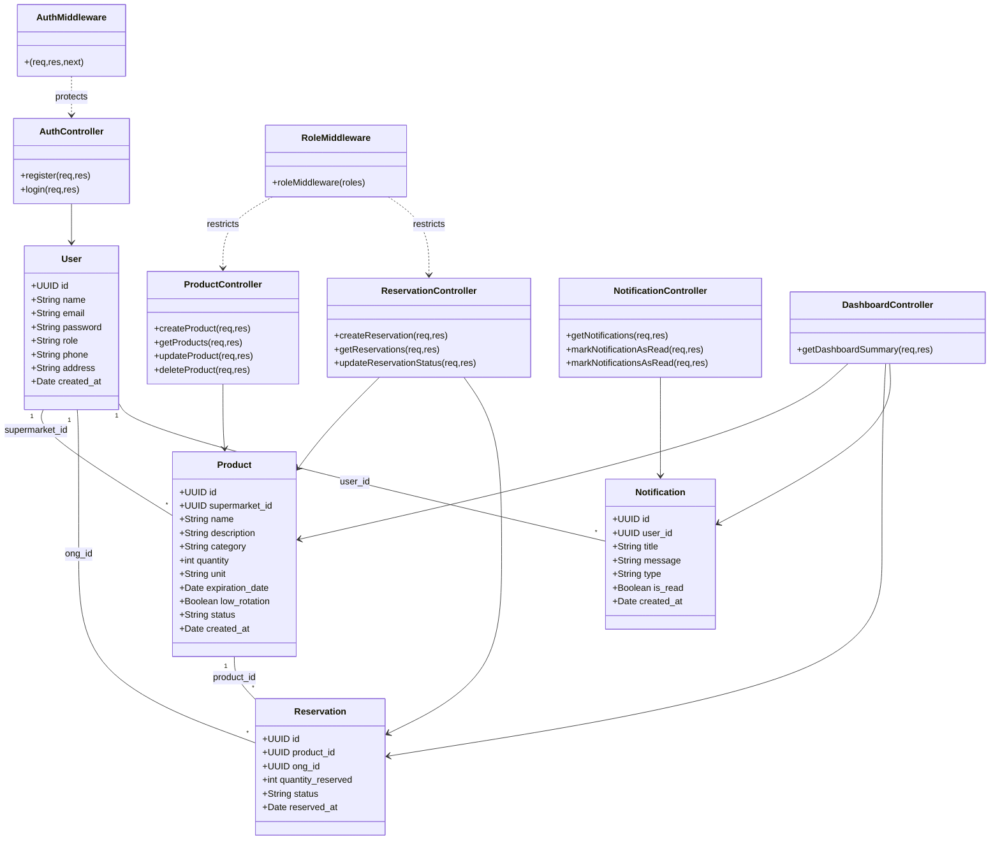

# UML Class Diagram

Below is the class UML diagram (Mermaid) generated from the codebase.

```mermaid
classDiagram
class User {
  +UUID id
  +String name
  +String email
  +String password
  +String role
  +String phone
  +String address
  +Date created_at
}
class Product {
  +UUID id
  +UUID supermarket_id
  +String name
  +String description
  +String category
  +int quantity
  +String unit
  +Date expiration_date
  +Boolean low_rotation
  +String status
  +Date created_at
}
class Reservation {
  +UUID id
  +UUID product_id
  +UUID ong_id
  +int quantity_reserved
  +String status
  +Date reserved_at
}
class Notification {
  +UUID id
  +UUID user_id
  +String title
  +String message
  +String type
  +Boolean is_read
  +Date created_at
}

class AuthController {
  +register(req,res)
  +login(req,res)
}
class ProductController {
  +createProduct(req,res)
  +getProducts(req,res)
  +updateProduct(req,res)
  +deleteProduct(req,res)
}
class ReservationController {
  +createReservation(req,res)
  +getReservations(req,res)
  +updateReservationStatus(req,res)
}
class NotificationController {
  +getNotifications(req,res)
  +markNotificationAsRead(req,res)
  +markNotificationsAsRead(req,res)
}
class DashboardController {
  +getDashboardSummary(req,res)
}
class AuthMiddleware {
  +(req,res,next)
}
class RoleMiddleware {
  +roleMiddleware(roles)
}

User "1" -- "*" Product : supermarket_id
Product "1" -- "*" Reservation : product_id
User "1" -- "*" Reservation : ong_id
User "1" -- "*" Notification : user_id

ProductController --> Product
ReservationController --> Product
ReservationController --> Reservation
AuthController --> User
NotificationController --> Notification
DashboardController --> Product
DashboardController --> Reservation
DashboardController --> Notification

AuthMiddleware ..> AuthController : protects
RoleMiddleware ..> ProductController : restricts
RoleMiddleware ..> ReservationController : restricts
```
